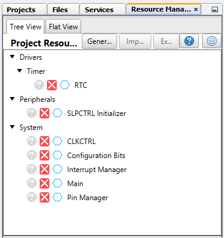
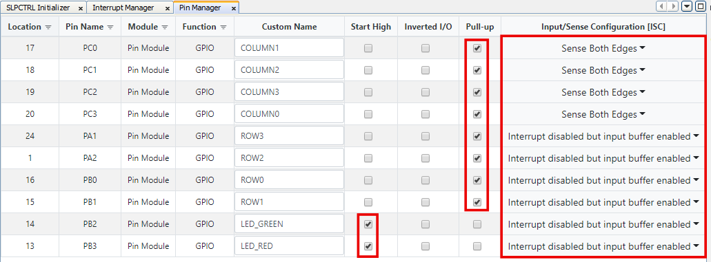
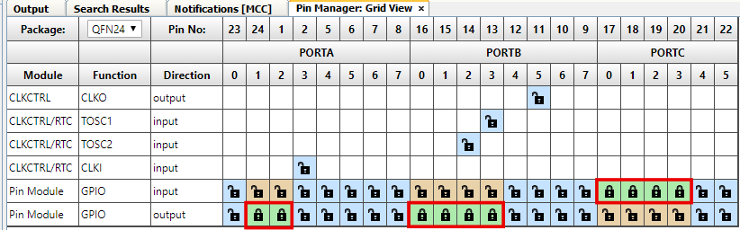
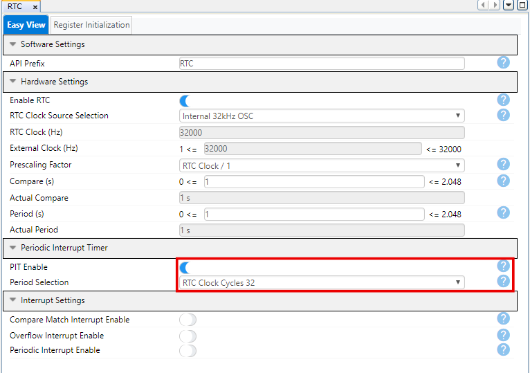
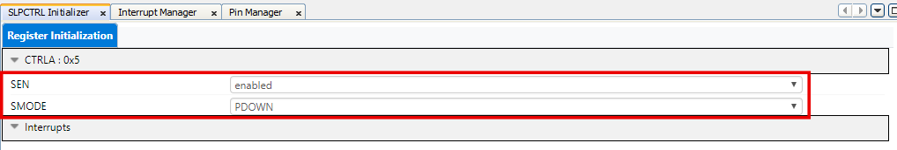
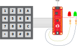

<!-- Please do not change this logo with link -->

# AN3407 - Using Matrix Keypad With AVR® Devices

This application note shows how a general keypad application can be implemented with tinyAVR® and megaAVR® devices. A conceptual overview of the operation of a matrix keypad and a demo application is presented. The demo shows a implementation of a keypad using advanced features to make the application more efficient and use less power.

The example in this application note may easily be changed to interface a smaller or larger matrix keypad, and is easy to implement into another application. The application may be used in all implementations using a matrix keypad, such as access control keypads, keyboards, or remote controls.

## Related Documentation

* [AN3407 - Using Matrix Keypad With AVR® Devices](https://microchip.com/DS00003407)
* [ATtiny1627 device page](https://www.microchip.com/wwwproducts/en/ATTINY1627)

## Software Used

- MPLAB® X IDE 5.45 or newer [(microchip.com/mplab/mplab-x-ide)](http://www.microchip.com/mplab/mplab-x-ide)
- MPLAB® XC8 2.31 or a newer compiler [(microchip.com/mplab/compilers)](http://www.microchip.com/mplab/compilers)
- MPLAB® Code Configurator (MCC) 4.1.0 or newer [(microchip.com/mplab/mplab-code-configurator)](https://www.microchip.com/mplab/mplab-code-configurator)
- MPLAB® Code Configurator Library 1.37.13 or newer [(microchip.com/mplab/mplab-code-configurator)](https://www.microchip.com/mplab/mplab-code-configurator)
- ATtiny 2.6.122 or newer Device Pack

## Hardware Used

* [Microchip ATtiny1627 Curiosity Nano Evaluation Kit](https://www.microchip.com/developmenttools/ProductDetails/DM080104)
* A 4x4 Matrix Keypad
* Two LEDs
* Two resistors
* Micro-USB cable (Type-A/Micro-B)

## Peripherals Configuration using MCC
### Added Peripherals

### Pin manager

### Periodic Interrupt Timer

### Sleep Controller

## Setup

* Connect the keypad to the ATmega1627 Curiosity Nano as follows:
  * Row 0: PB0
  * Row 1: PB1
  * Row 2: PA2
  * Row 3: PA1
  * Column 0: PC3
  * Column 1: PC0
  * Column 2: PC1
  * Column 3: PC2
* Connect the green LED and a resistor in series between VTG and PB2
* Connect the red LED and a resistor in series between VTG and PB3

## Operation

* Connect the ATtiny1627 Curiosity Nano to a computer using the USB cable
* Download the zip file or clone the example to get the source code
* Open the .X file with the MPLAB® X IDE
* Set the *attiny1627-using-matrix-keypad-with-avr-devices-mplab-mcc* project as main project. Right click on the project in the *Projects* tab and click *Set as Main Project*.
* Program the project to the board: right click on the project and click *Make and Program Device*.
* The pin-code “123ABC” is programmed to be the passcode. Try pressing this code followed by pound (#) to observe the green LED flashing. Try a different code to observe the red LED flashing.

## Summary
This example has shown one way of implementing a matrix keypad with an AVR® microcontroller.
